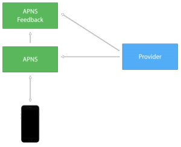

# [New Provider API](https://developer.apple.com/library/ios/documentation/NetworkingInternet/Conceptual/RemoteNotificationsPG/Chapters/APNsProviderAPI.html#//apple_ref/doc/uid/TP40008194-CH101)

## Basic knowledge

APNS service support send notification to IOS, tvOS, watchOS, OS X device with http2 API. Each interaction starts with a POST request, containing a JSON payload, that you send from your provider server to APNs. APNs then forwards the notification to your app on a specific user device.

Here’s the big one. In the past, the push notification workflow has been tedious with no request/response model. Every time you send a push notification, you must then poll the APNS Feedback service to check each device token is still accepting your pushes (shown below).



the new Provider API is based on [HTTP/2.0](https://http2.github.io/), which means it is a req/res model and futhermore multiplexed(so you may have multiple current requests in the same connection), one certificate and binary.

**The new api advantages(carrots)**:

1.  Request/Response Model.

    Every time a request is made, the feedback comes back instantly, which means the Feedback service is essentially obsolete. With the new HTTP/2 API there is no separate feedback service. If you send a notification to a disabled device, you will get an appropriate HTTP response in return.

    

2.  One Certificate

    APNS provide a [Universal Push Notification Client SSL Certificate](https://developer.apple.com/library/ios/documentation/IDEs/Conceptual/AppDistributionGuide/AddingCapabilities/AddingCapabilities.html#//apple_ref/doc/uid/TP40012582-CH26-SW11) to establish connection and send notification which obtain from [Apple Developer Member Center](https://idmsa.apple.com/IDMSWebAuth/login?&appIdKey=891bd3417a7776362562d2197f89480a8547b108fd934911bcbea0110d07f757&path=%2F%2Fmembercenter%2Findex.action), This certificate enables connection to both the APNs Production and Development environments.

3.  Multiplexed

    APNS based on HTTP/2.0, it also supports Multiplexed, supports multiple concurrent streams for each connection,
    But the exact number of streams is based on server load.

4.  Binary

    HTTP2 transmit header and data with binary, so it very efficent.

5.  Payload Size

    with the new provider API, the payload size has increase from 2KB to 4KB.


## How to send notificaton with new API ?

### Request (POST)

-   HEADERS

    | Header Name | Value           |
    | ----------- | --------------- |
    | :method     | POST            |
    | :scheme     | https           |
    | :path       | /3/device/target-device-token |
    | :port       | 443             |
    | host        | api.development.push.apple.com |
    | apns-id     | eabeae54-14a8-11e5-b60b-1697f925ec7b |
    | apns-topic  | MyAppTopic    |
    | apns-expiration | 0           |
    | apns-priority   | 10          |
    | content-length  | 33          |

    **Tips**:

    -   `apns-id`: A identifer of notification, if there is an error sending the notification, APNs uses this value to identify the notification to your server. If you omit this header, a new UUID is created by APNs and returned in the response.

    -   `apns-topic`: A topic of notification, generally is you bundle ID which contains in you certificate.
    If you certificate include multiple topics, you must provide this. If you don't omit this, APNS will use the
    `certificate subject` as the topic by default.

    -   `apns-expiration`: The TTL of notification can be stored in apns when send to device failed.

    -   `apns-priority`: Priority of notification, usually is two number `5` or `10`.

        > **10**:  Send the push message immediately. **default**

        > **5**: Send the push message at a time that takes into account power considerations for the device.

    -   `content-length`: The length of the body content. You must provide a value for this header, and the body length must be less than or equal to 4096 bytes.

### Response

-   HEADERS

    | Header Name  | Value          |
    | ------------ | -------------- |
    | apns-id      | a uuid of notification wihch you passed or created by apns |
    | status       | The HTTP status code, [show all status](https://developer.apple.com/library/ios/documentation/NetworkingInternet/Conceptual/RemoteNotificationsPG/Chapters/APNsProviderAPI.html#//apple_ref/doc/uid/TP40008194-CH101-SW3) |

-   BODY

    -   If a successful request, the body of the response is **empty**.

    -   If a failure request occured, the following is response body.

        | Key          | Describtion    |
        | -------------| ---------------|
        | reason       | The error indicating the reason for the failure, [show all reasons](https://developer.apple.com/library/ios/documentation/NetworkingInternet/Conceptual/RemoteNotificationsPG/Chapters/APNsProviderAPI.html#//apple_ref/doc/uid/TP40008194-CH101-SW5) |
        | timestamp    | time           |

        **Tips**:

        -   `timestamp`:  If the value in the: status header is **410**, the value of this key is the last time
            at which APNs confirmed that the device token was no longer valid for the topic. Stop pushing notifications until the device registers a token with a later timestamp with your provider.

### Example

1. Use [node-http2](https://github.com/molnarg/node-http2)

    ```js
    var http2 = require('http2');
    var path = require('path');

    // we can set certificate and key with three ways:
    // 1: Set the htt2.globalAgent = new http2.Agent({...})
    // 2. Set options.agent = new http2.Agent({...})
    // 3. Set certificate and key in options:
    //       options.cert = ...
    //       options.key = ...
    //       options.keepAlive = ...
    //       options.rejectUnAuthrized = ...
    var options = {
        'rejectUnauthorized': true,
        'cert': fs.readFileSync(path.join(__dirname, '/xxx.crt')), // binary
        'key': fs.readFileSync(path.join(__dirname, '/xxx.key')), // binary
        'method': 'POST', // apns only accept this method.
        'host': 'api.development.push.apple.com', // apns development or production gateway.
        'protocol': 'https', // this node-http2 will set to https by default.
        'port': '443', // this node-http2 will set to 443 by default.
        'path': '/3/device/<device-token>' // device-token is you send notification target.
    };

    options.headers = {
        'apns-id': 'eabeae54-14a8-11e5-b60b-1697f925ec7b', // optional.
        'apns-topic': 'aaa', // optional, default is certificate subject.
        'apns-expiration': 0, // optional, default 0.
        'apns-priority': 10, // optional, default 10.
        'content-length': 33
    }

    // If you want to reuse connection,
    // you should use the same htt2.Agent instance.
    // the htt2.Agent instance will store the connection in
    options.agent = new htt2.Agent(options);
    var request = htt2.get(options);

    // when receive a response, this event will be fired.
    request.on('response', function(res){

    });

    // when server push data, this event will be fired.
    request.on('push', function(pushRequest){

    });
    ```

2. Use `Curl`, If you CURL does not support HTTP2, [click here](../../linux/curl/curl-http2.md)

    ```bash
    curl -i -X POST \
    -H "Content-Type:application/json" \
    -H "apns-id:eabeae54-14a8-11e5-b60b-1697f925ec7b" \
    -H "apns-expiration:0" \
    -H "apns-priority:10" \
    -H "content-length:33" \
    -d \
    ' {
        "aps" : {
            "alert" : "Hello World!"
        }
    }' \
    --cert ./dev.pem \
    --key ./dev.pem \
    --http2 'https://api.development.push.apple.com/3/device/00fc13adff785122b4ad28809a3420982341241421348097878e577c991de8f0'
    ```

    **Tips**:

    -   `--cert`, `--key`:  The certificate must be in **PKCS#12**(`.p12`) format if using Secure Transport, or **PEM**(`.pem`) format if using any other engine.

    -   `--crlfile`:  HTTPS/FTPS Provide a file using **PEM**(`.pem`) format with a Certificate Revocation List that may specify peer certificates that are to be considered revoked.
